# Git Assignment - Vivek Zanjad

GitHub Username: vivek-clover  
Name: Vivek Zanjad  
Email: vivek.zanjad@cloverinfotech.com  

---

# Section A: Git Basics + Setup

## Q1. Check if Git is installed. What version do you have?

### Command:
```bash
git --version
```

### Output:
Example:
```bash
git version 2.43.0.windows.1
```

Screenshot: 

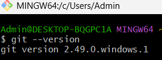

---

## Q2. Set your name and email in global config

### Commands:
```bash
git config --global user.name "Vivek Zanjad"
git config --global user.email "vivek.zanjad@cloverinfotech.com"
```

Verify:
```bash
git config --global --list
```

📸 Screenshot:
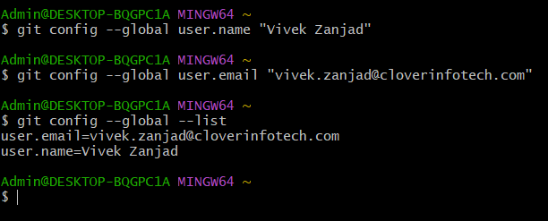

---

## Q3. Create folder and initialize Git repository

### Commands:
```bash
mkdir git-assignment-VivekZanjad
cd git-assignment-VivekZanjad
git init
git status
```

### Output:
Repository initialized successfully.

📸 Screenshot:
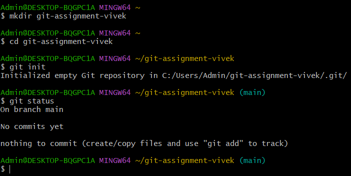

---

## Q4. Create README.md and commit

### Command:
```bash
echo "# Git Assignment - Vivek Zanjad" > README.md
git add README.md
git commit -m "Initial commit"
```

📸 Screenshot:
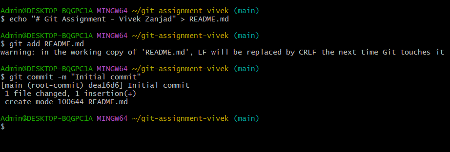

---

## Q5. Run git log and copy hash

### Command:
```bash
git log
```

### Commit Hash:
Example:
```bash
63a9a3e705f8eda4b073b1d36fd98c72db21b668 
```

📸 Screenshot:
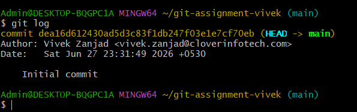

---

## Q6. Perform changes and make 5 commits

### Commands:
```bash
echo "Commit 1" >> README.md
git add .
git commit -m "Commit 1"

echo "Commit 2" >> README.md
git add .
git commit -m "Commit 2"

echo "Commit 3" >> README.md
git add .
git commit -m "Commit 3"

echo "Commit 4" >> README.md
git add .
git commit -m "Commit 4"

echo "Commit 5" >> README.md
git add .
git commit -m "Commit 5"
```

📸 Screenshot of git log
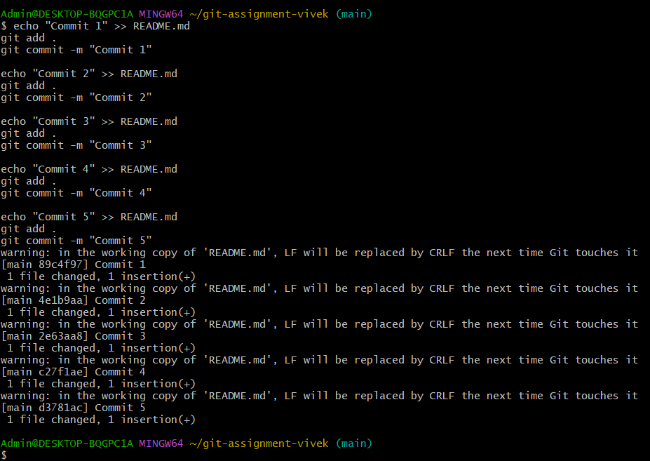

---

# Section B: Branching & Commits

## Q7. Create branch dev and switch to it

### Commands:
```bash
git branch dev
git checkout dev
git branch
```

### Output:
```bash
* dev
  main
```

📸 Screenshot
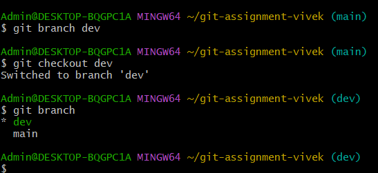

---

## Q8. Create features.txt in dev branch

### Commands:
```bash
echo Login > features.txt
echo Signup >> features.txt
echo Dashboard >> features.txt

git add features.txt
git commit -m "Added features file"
```

📸 Screenshot:
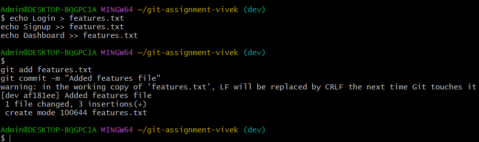

---

## Q9. Switch back to main and check features.txt

### Commands:
```bash
git checkout main
dir
```

### Answer:
`features.txt` is not visible because it exists only in the `dev` branch and has not been merged into `main`.

📸 Screenshot 
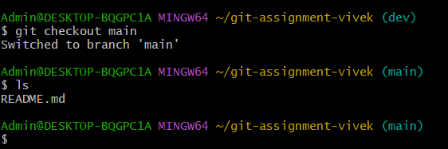
---

## Q10. Merge dev into main

### Commands:
```bash
git merge dev
git log --oneline
```

📸 Screenshot 
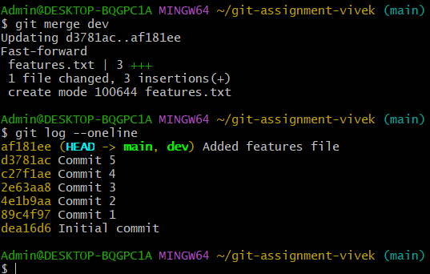
---

## Q11. Create .gitignore file

### Commands:
```bash
echo node_modules/ > .gitignore
echo *.log >> .gitignore

git add .gitignore
git commit -m "Added gitignore"
```

📸 Screenshot 
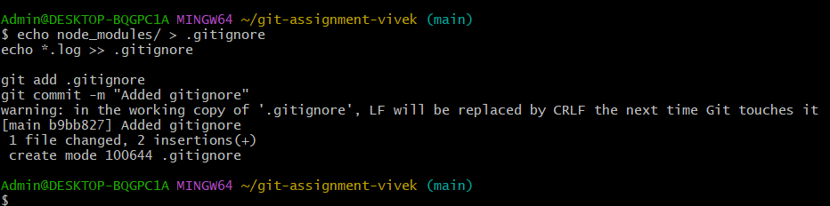
---

# Section C: GitHub Remote + Push/Pull

## Q12. Create empty repo on GitHub

Repo Name:
```bash
git-assignment-VivekZanjad
```

📸 Screenshot
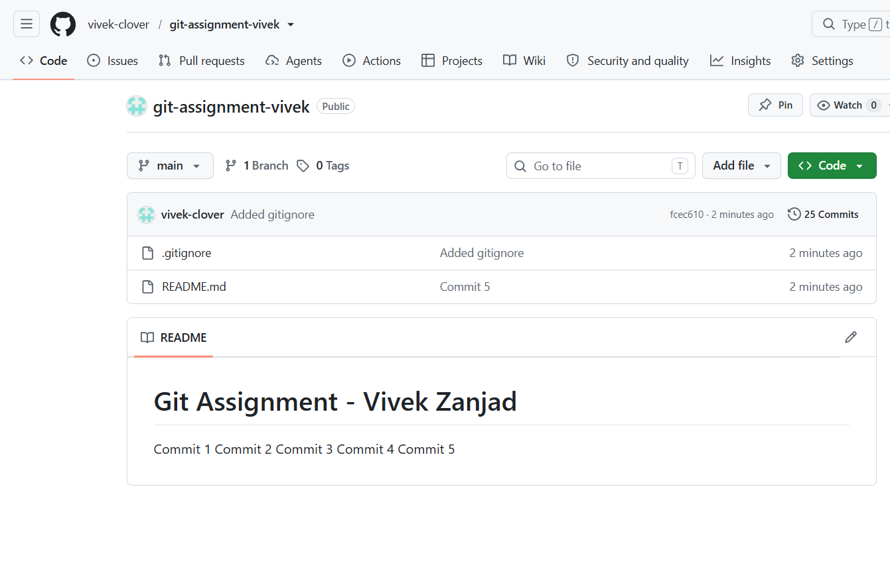
---

## Q13. Connect local repo to GitHub remote

### Command:
```bash
git remote add origin https://github.com/vivek-clover/git-assignment-VivekZanjad.git
```

Verify:
```bash
git remote -v
```

📸 Screenshot 
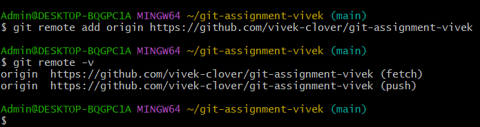
---

## Q14. Push code to GitHub

### Command:
```bash
git push -u origin main
```

📸 Screenshot:
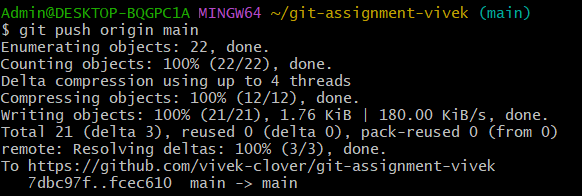
---

## Q15. GitHub Repo Link

Repo Link:
```bash
https://github.com/vivek-clover/git-assignment-VivekZanjad
```

---

## Q16. Create bugfix.txt on GitHub and pull locally

After creating file on GitHub:

### Command:
```bash
git pull origin main
```

Verify:
```bash
dir
```

Output should show:
```bash
bugfix.txt
```

📸 Screenshot
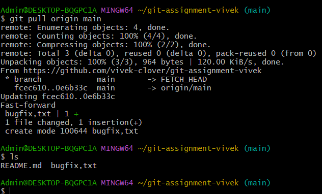
---

# Section D: Undo, Conflicts & Collaboration

## Q17. Undo changes in README.md

### Commands:
```bash
echo Testing undo >> README.md
git status
git restore README.md
git status
```

### Result:
Changes discarded successfully.

📸 Screenshot:
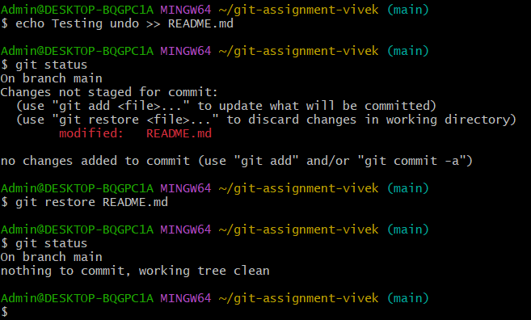
---

## Q18. Amend last commit message

### Command:
```bash
git commit --amend -m "Initial commit - Added README"
```

📸 Screenshot:
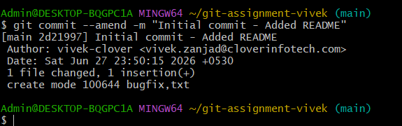
---

## Q19. Conflict Task

### Step 1:
```bash
echo Line from main > conflict.txt
git add conflict.txt
git commit -m "Added conflict file from main"
```

### Step 2:
```bash
git checkout -b conflict-branch
```

Modify:
```bash
echo Line from branch > conflict.txt
git add conflict.txt
git commit -m "Updated conflict file from branch"
```

### Step 3:
```bash
git checkout main
git merge conflict-branch
```

Conflict will occur.

### Step 4:
Resolve conflict manually.

Final content of `conflict.txt`:
```txt
Line from main
Line from branch
```

Then:
```bash
git add conflict.txt
git commit -m "Resolved merge conflict"
```

📸 Screenshot:
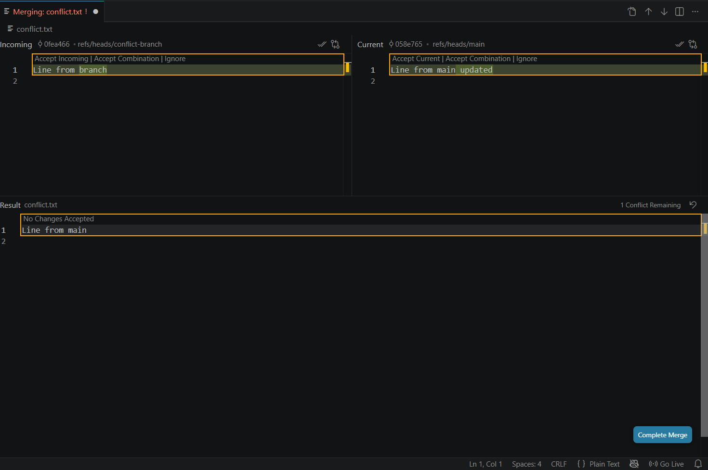

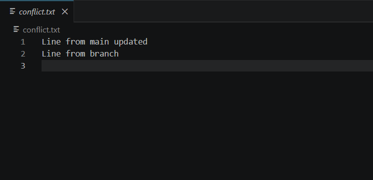

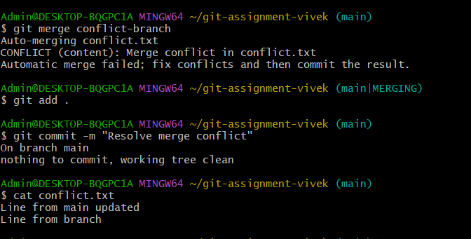
---

## Q20. Fork colleague repo and clone locally

Example:
```bash
git clone https://github.com/DashamiCI/branching-drill-team
```

Repo Name:
```bash
branching-drill-team
```

📸 Screenshot 
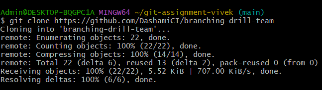

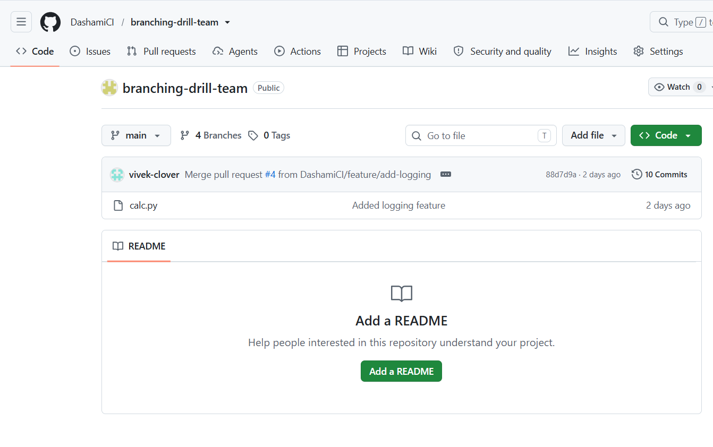
---

## Q21. Add collaborator

Go to:
GitHub Repo → Settings → Collaborators → Add People

Add collaborator successfully.

📸 Screenshot 
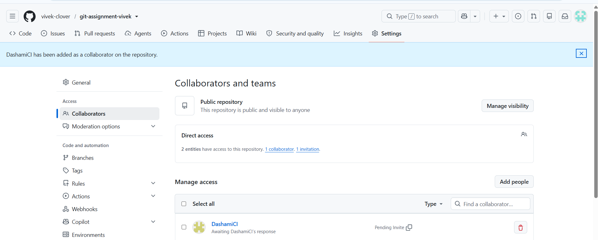
---

# Final Submission

## GitHub Repo Link
```bash
https://github.com/vivek-clover/git-assignment-vivek
```